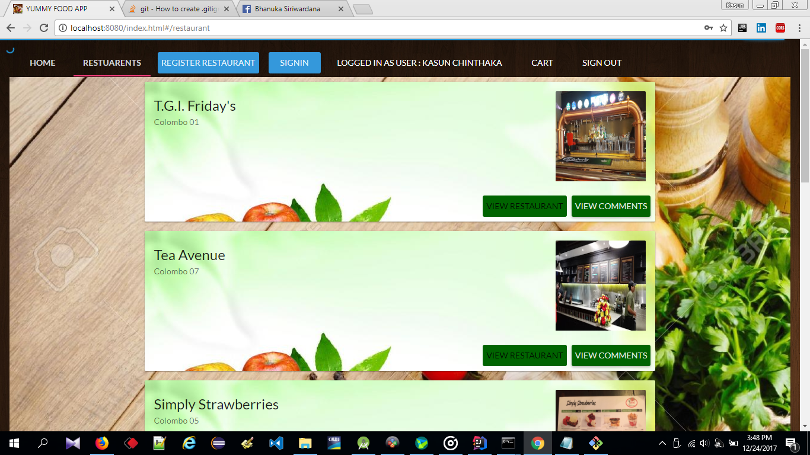
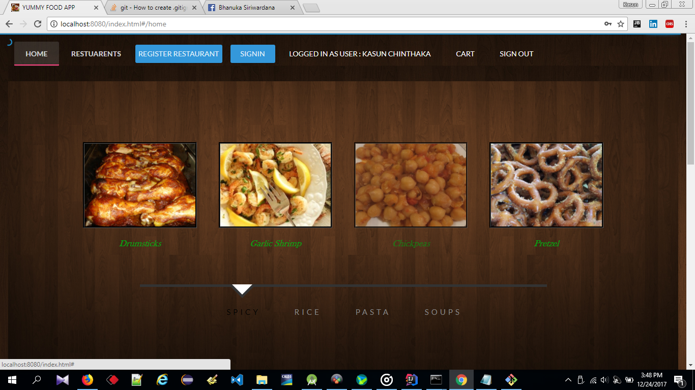

<html>
<body>
<h1>Yumy Online Food Seraching System</h1>

<h2>What is this repository for?</h2>

    
    
    

<ul>
  <li>This repository is for Yummy Online-Web</li>
  <li>Technologies: - REST with Java8 (JAX-RS) using Jersey, AngularJs, AngularMaterial, MongoDB, Maven, JSON</li>
  <li>Group Titans-FIT UOM</li>
  <li>Mentored By Virtusa Pvt. Ltd</li>
  <li>Version 1.0</li>

</ul>  

</body>
</html>
